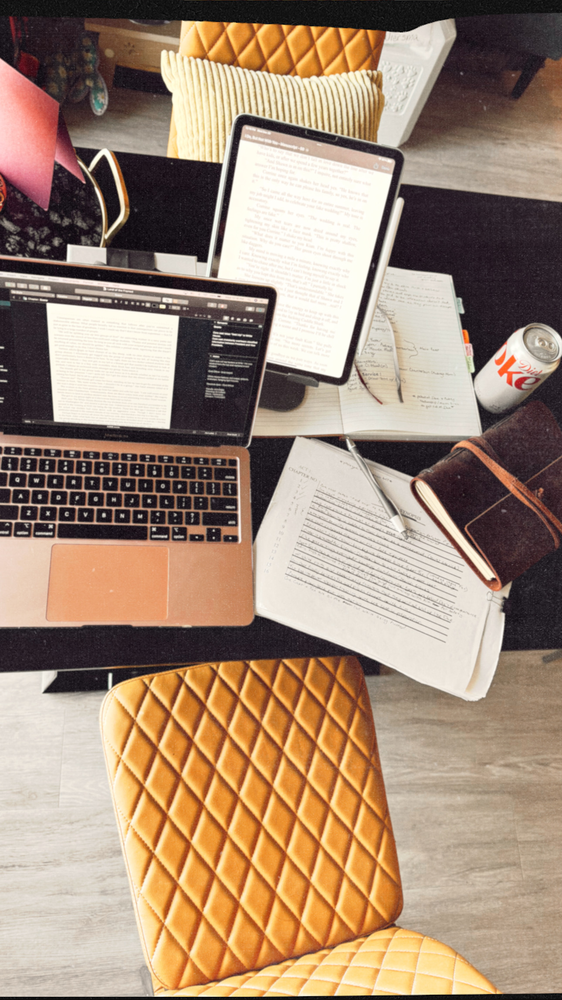

# Digital Platforms For Publishing Project
## Published by Collin Michael Dueno on 03/07/2024
This is a readme file for a Digital Publishing course through the University of Wisconsin - Green Bay

<html>
<title> Collin Michael Intro </title>
<head>

<head>
<body>
<h1>Collin Michael Introduction</h1>

As a child, I had a fairly significant connection to the publishing industry on the consumer end of things. Specifically print publishing. My collection of books has grown, and followed me since the late 90’s. My expansive journey through print-published books inevitably lead me to desire to become a writer of my own – creatively, that is. Print publishing will always hold a special place in my heart due to the trophy that you get to place on your shelf when you’re finished. I have long hoped that my words will live as a trophy on somebody’s shelf one day.

Studying the publishing industry both independently and academically has been a crucial part in preparing myself to begin my professional journey with writing. Because the industry is ever-changing, understanding the history and all of the moving parts surrounding publishing is important to the success of a writer. I actively focus on researching and understanding the “do’s and don’ts” of both digital and print publishing. This is including but not limited to recognizing and comparing the publishing process as well as the individual rights of the writer themselves. With the heavy work of my research behind me, I have successfully begun my writing process. My ultimate goal is to traditionally print-publish, while independently digital publishing on the side. I find that to be the perfect balance of structure and freedom.
<a href="Project Reflection.html">Project Reflection</a>
